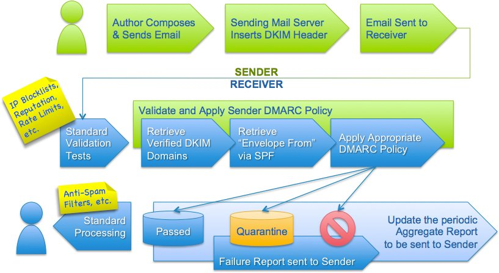

---
`MX` : Is set up to receive emails

---
`DKIM` : DomainKeys Identified Mail (DKIM) is an email security standard designed to make sure that an email that claims to have come from a specific domain was indeed authorized by the owner of that domain.

- [Specification](https://docs.aws.amazon.com/ses/latest/dg/send-email-authentication-dkim.html)

---
`DMARC` : Domain-based Message Authentication, Reporting and Conformance (DMARC) is an email authentication protocol that uses Sender Policy Framework (SPF) and DomainKeys Identified Mail (DKIM) to detect email spoofing. In order to comply with DMARC, messages must be authenticated through either SPF or DKIM, or both.

example: `_dmarc.example.com	TXT	"v=DMARC1;p=quarantine;pct=25;rua=mailto:dmarcreports@example.com"`
- [Specification](https://docs.aws.amazon.com/ses/latest/dg/send-email-authentication-dmarc.html)

---
`SPF` : Sender Policy Framework (SPF) is an email validation standard that's designed to prevent email spoofing. 
      Domain owners use SPF to tell email providers which servers are allowed to send email from their domains. 
- Email spoofing: I's a technique used in spam and phishing attacks to trick users into thinking a message came from a person or entity they either know or can trust.

example: `<subdomain>.<domain>	TXT	"v=spf1 include:example.com include:amazonses.com ~all"`
- [Specification](https://docs.aws.amazon.com/ses/latest/dg/send-email-authentication-spf.html)

---
`MAIL FROM` : By setting up a custom MAIL FROM domain, your emails can comply with Domain-based Message Authentication, Reporting and Conformance (DMARC). DMARC enables a sender's domain to indicate that emails sent from the domain are protected by one or more authentication systems.

- [Specification](https://docs.aws.amazon.com/ses/latest/dg/mail-from.html)
